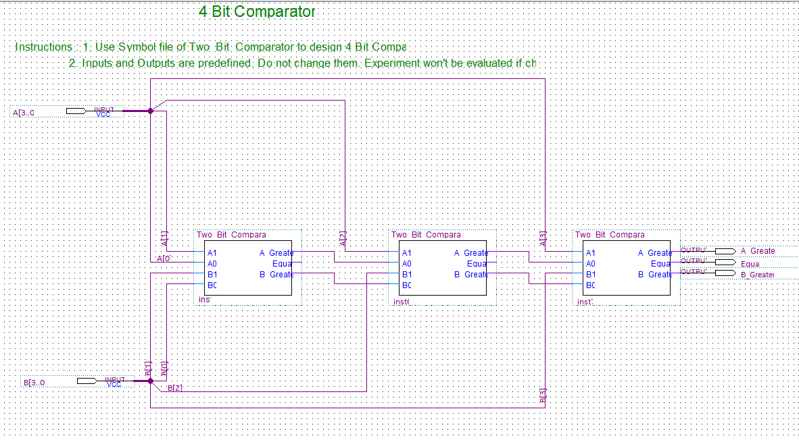

# Verilog-For-Comparator

This is the verilog code for Multiplexer Implementation.

  

  <h3 align="center">8:1 Mux from 4:1 Mux</h3>

  

    Welcome to My Github Page!
     This Repo contains the verilog HDL code to implement a 8:1 Mux using 4:1.
     The above picture is Circuit Connection of the implemented derived from the symbol file.
     Feel free to fork the repo to try and modify the logic to your interest.
     
  Kindly give the project a  star if you find it useful.
    
  

